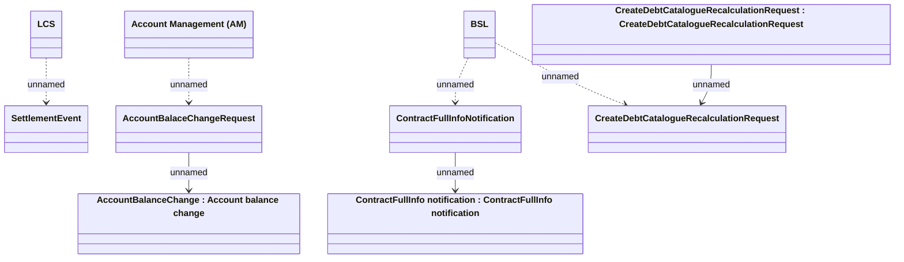

# RabbitMQ messages

- **Diagram Type**: Logical
- **Package**: HomerSelect/BSL/Modules/Debt catalogue/Interface Consumed
- **Diagram ID**: 161231
- **Elements**: 10
- **Connectors**: 7

```mermaid
classDiagram
    class SettlementEvent["SettlementEvent"]
    class LCS["LCS"]
    class AccountBalanceChange_Account_balance_change["AccountBalanceChange : Account balance change"]
    class AccountBalaceChangeRequest["AccountBalaceChangeRequest"]
    class Account_Management_AM["Account Management (AM)"]
    class ContractFullInfo_notification_ContractFullInfo_notification["ContractFullInfo notification : ContractFullInfo notification"]
    class ContractFullInfoNotification["ContractFullInfoNotification"]
    class CreateDebtCatalogueRecalculationRequest_CreateDebtCatalogueR["CreateDebtCatalogueRecalculationRequest : CreateDebtCatalogueRecalculationRequest"]
    class CreateDebtCatalogueRecalculationRequest["CreateDebtCatalogueRecalculationRequest"]
    class BSL["BSL"]
    BSL ..> CreateDebtCatalogueRecalculationRequest : unnamed
    BSL ..> ContractFullInfoNotification : unnamed
    CreateDebtCatalogueRecalculationRequest_CreateDebtCatalogueR --> CreateDebtCatalogueRecalculationRequest : unnamed
    ContractFullInfoNotification --> ContractFullInfo_notification_ContractFullInfo_notification : unnamed
    Account_Management_AM ..> AccountBalaceChangeRequest : unnamed
    AccountBalaceChangeRequest --> AccountBalanceChange_Account_balance_change : unnamed
    LCS ..> SettlementEvent : unnamed
```
