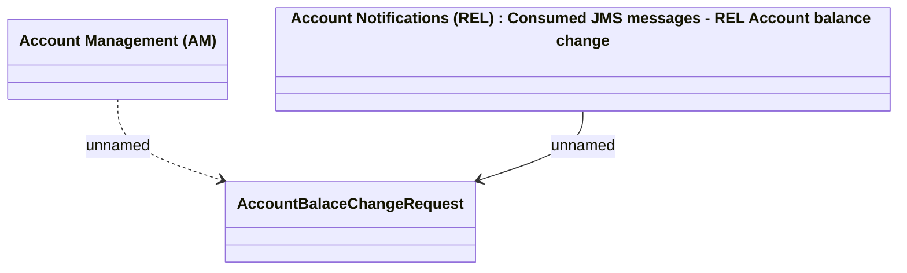

# {DEL}AM JMS

- **Diagram Type**: Logical
- **Package**: HomerSelect/BSL/Modules/Debt catalogue/Interface Consumed
- **Diagram ID**: 161228
- **Elements**: 3
- **Connectors**: 2

```mermaid
classDiagram
    class Account_Notifications_REL_Consumed_JMS_messages_REL_Account_["Account Notifications (REL) : Consumed JMS messages - REL Account balance change"]
    class AccountBalaceChangeRequest["AccountBalaceChangeRequest"]
    class Account_Management_AM["Account Management (AM)"]
    Account_Management_AM ..> AccountBalaceChangeRequest : unnamed
    Account_Notifications_REL_Consumed_JMS_messages_REL_Account_ --> AccountBalaceChangeRequest : unnamed
```
