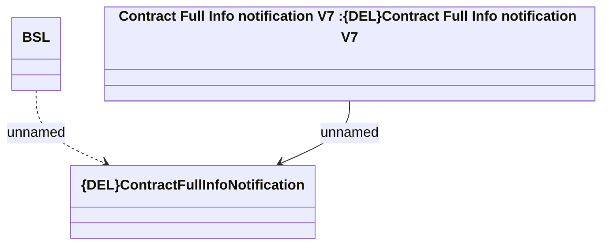

# {DEL}BSL JMS

- **Diagram Type**: Logical
- **Package**: HomerSelect/BSL/Modules/Debt catalogue/Interface Consumed
- **Diagram ID**: 161229
- **Elements**: 3
- **Connectors**: 2

```mermaid
classDiagram
    class Contract_Full_Info_notification_V7_DEL_Contract_Full_Info_no["Contract Full Info notification V7 :{DEL}Contract Full Info notification V7"]
    class DEL_ContractFullInfoNotification["{DEL}ContractFullInfoNotification"]
    class BSL["BSL"]
    BSL ..> DEL_ContractFullInfoNotification : unnamed
    Contract_Full_Info_notification_V7_DEL_Contract_Full_Info_no --> DEL_ContractFullInfoNotification : unnamed
```
