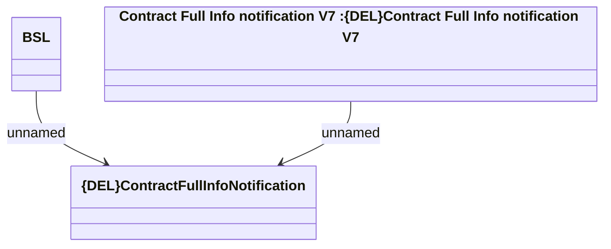

# {DEL}BSL JMS

```mermaid
classDiagram
    class Contract_Full_Info_notification_V7_DEL_Contract_Full_Info_no["Contract Full Info notification V7 :{DEL}Contract Full Info notification V7"]
    class DEL_ContractFullInfoNotification["{DEL}ContractFullInfoNotification"]
    class BSL["BSL"]
    BSL --> DEL_ContractFullInfoNotification : unnamed
    Contract_Full_Info_notification_V7_DEL_Contract_Full_Info_no --> DEL_ContractFullInfoNotification : unnamed
```
