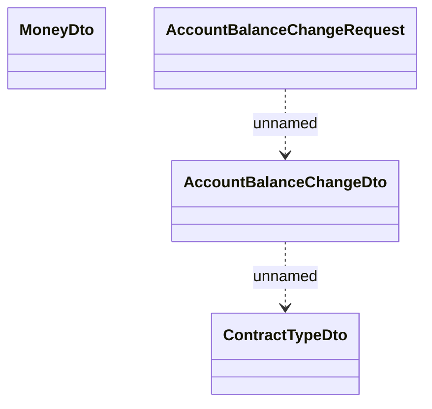

# Account balance change

- **Diagram Type**: Logical
- **Package**: HomerSelect/BSL/Modules/Debt catalogue/Interface Consumed/RabbitMQ/AccountBalanceChange
- **Diagram ID**: 155458
- **Elements**: 4
- **Connectors**: 2

