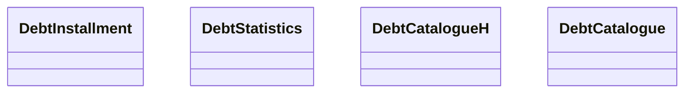

# v1.0

- **Diagram Type**: Logical
- **Package**: HomerSelect/BSL/Modules/Debt catalogue/Interface Provided/KAFKA/v1.0
- **Diagram ID**: 143436
- **Elements**: 4
- **Connectors**: 0

```mermaid
classDiagram
    class DebtInstallment["DebtInstallment"]
    class DebtStatistics["DebtStatistics"]
    class DebtCatalogueH["DebtCatalogueH"]
    class DebtCatalogue["DebtCatalogue"]
```
