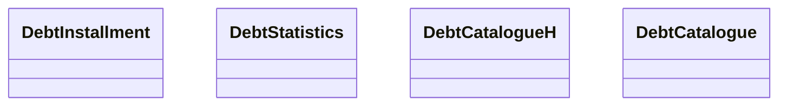

# v1.0

```mermaid
classDiagram
    class DebtInstallment["DebtInstallment"]
    class DebtStatistics["DebtStatistics"]
    class DebtCatalogueH["DebtCatalogueH"]
    class DebtCatalogue["DebtCatalogue"]
```
