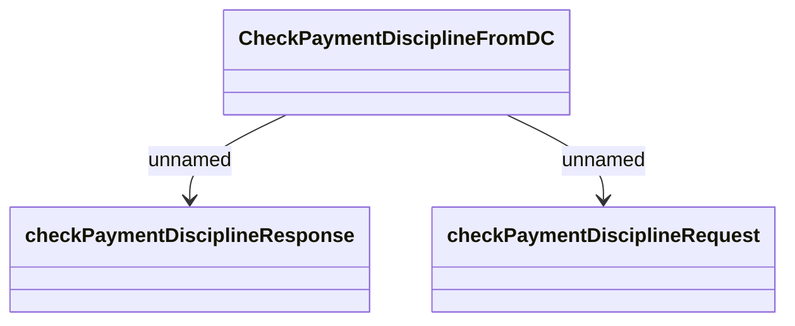

# CheckPaymentDisciplineFromDC

```mermaid
classDiagram
    class checkPaymentDisciplineResponse["checkPaymentDisciplineResponse"]
    class checkPaymentDisciplineRequest["checkPaymentDisciplineRequest"]
    class CheckPaymentDisciplineFromDC["CheckPaymentDisciplineFromDC"]
    CheckPaymentDisciplineFromDC --> checkPaymentDisciplineResponse : unnamed
    CheckPaymentDisciplineFromDC --> checkPaymentDisciplineRequest : unnamed
```
