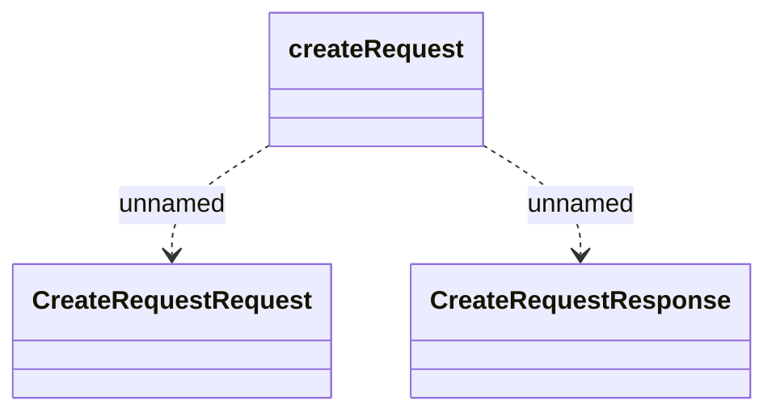

# CreateDebtCatalogueRequest

- **Diagram Type**: Logical
- **Package**: HomerSelect/BSL/Modules/Debt catalogue/Interface Provided/REST/CreateDebtCatalogueRequest
- **Diagram ID**: 155604
- **Elements**: 3
- **Connectors**: 2

