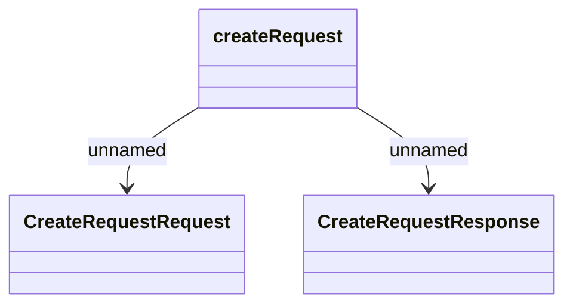

# CreateDebtCatalogueRequest

```mermaid
classDiagram
    class CreateRequestResponse["CreateRequestResponse"]
    class CreateRequestRequest["CreateRequestRequest"]
    class createRequest["createRequest"]
    createRequest --> CreateRequestRequest : unnamed
    createRequest --> CreateRequestResponse : unnamed
```
