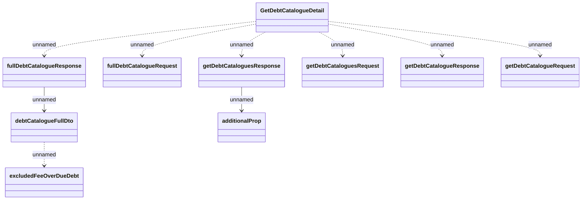

# DebtCatalogueDetail

- **Diagram Type**: Logical
- **Package**: HomerSelect/BSL/Modules/Debt catalogue/Interface Provided/REST/DebtCatalogueDetail
- **Diagram ID**: 155679
- **Elements**: 10
- **Connectors**: 9

