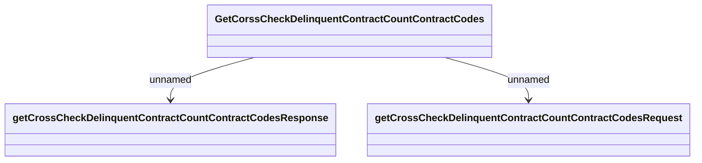

# GetCrossCheckDelinquentContractCount

```mermaid
classDiagram
    class getCrossCheckDelinquentContractCountContractCodesResponse["getCrossCheckDelinquentContractCountContractCodesResponse"]
    class getCrossCheckDelinquentContractCountContractCodesRequest["getCrossCheckDelinquentContractCountContractCodesRequest"]
    class GetCorssCheckDelinquentContractCountContractCodes["GetCorssCheckDelinquentContractCountContractCodes"]
    GetCorssCheckDelinquentContractCountContractCodes --> getCrossCheckDelinquentContractCountContractCodesResponse : unnamed
    GetCorssCheckDelinquentContractCountContractCodes --> getCrossCheckDelinquentContractCountContractCodesRequest : unnamed
```
