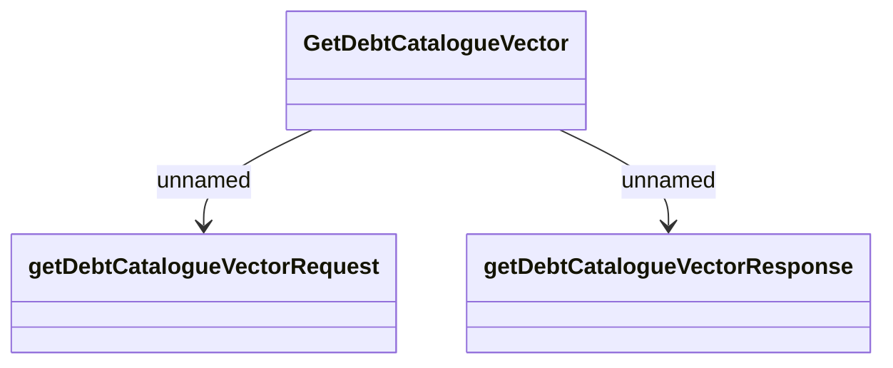

# GetDebtCatalogueVector

```mermaid
classDiagram
    class getDebtCatalogueVectorResponse["getDebtCatalogueVectorResponse"]
    class getDebtCatalogueVectorRequest["getDebtCatalogueVectorRequest"]
    class GetDebtCatalogueVector["GetDebtCatalogueVector"]
    GetDebtCatalogueVector --> getDebtCatalogueVectorRequest : unnamed
    GetDebtCatalogueVector --> getDebtCatalogueVectorResponse : unnamed
```
