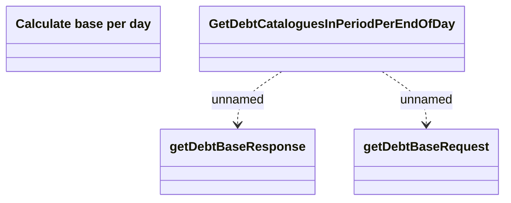

# GetDebtCataloguesInPeriodPerEndOfDay

- **Diagram Type**: Logical
- **Package**: HomerSelect/BSL/Modules/Debt catalogue/Interface Provided/REST/GetDebtCataloguesInPeriodPerEndOfDay
- **Diagram ID**: 155680
- **Elements**: 4
- **Connectors**: 2

