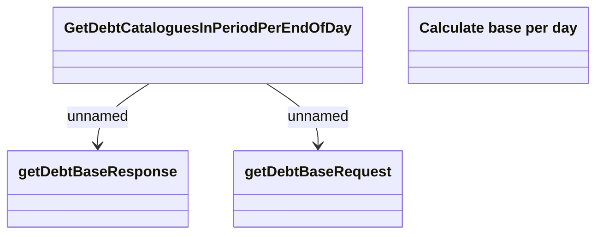

# GetDebtCataloguesInPeriodPerEndOfDay

```mermaid
classDiagram
    class getDebtBaseResponse["getDebtBaseResponse"]
    class getDebtBaseRequest["getDebtBaseRequest"]
    class GetDebtCataloguesInPeriodPerEndOfDay["GetDebtCataloguesInPeriodPerEndOfDay"]
    class Calculate_base_per_day["Calculate base per day"]
    GetDebtCataloguesInPeriodPerEndOfDay --> getDebtBaseResponse : unnamed
    GetDebtCataloguesInPeriodPerEndOfDay --> getDebtBaseRequest : unnamed
```
