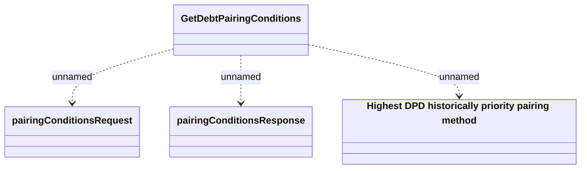

# GetDebtPairingConditions

- **Diagram Type**: Logical
- **Package**: HomerSelect/BSL/Modules/Debt catalogue/Interface Provided/REST/GetDebtPairingConditions
- **Diagram ID**: 155606
- **Elements**: 4
- **Connectors**: 3

