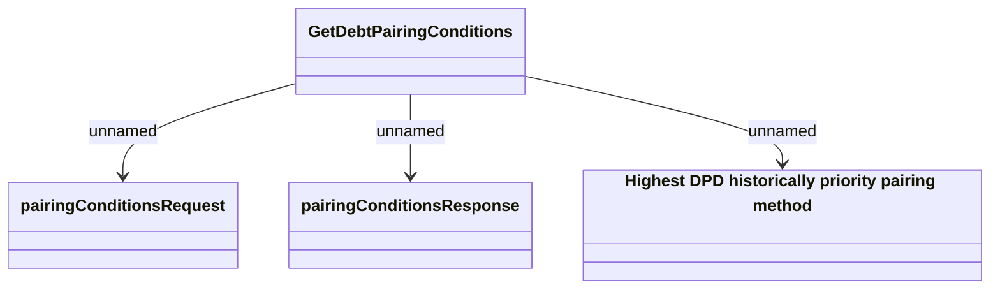

# GetDebtPairingConditions

```mermaid
classDiagram
    class Highest_DPD_historically_priority_pairing_method["Highest DPD historically priority pairing method"]
    class pairingConditionsResponse["pairingConditionsResponse"]
    class pairingConditionsRequest["pairingConditionsRequest"]
    class GetDebtPairingConditions["GetDebtPairingConditions"]
    GetDebtPairingConditions --> pairingConditionsRequest : unnamed
    GetDebtPairingConditions --> pairingConditionsResponse : unnamed
    GetDebtPairingConditions --> Highest_DPD_historically_priority_pairing_method : unnamed
```
