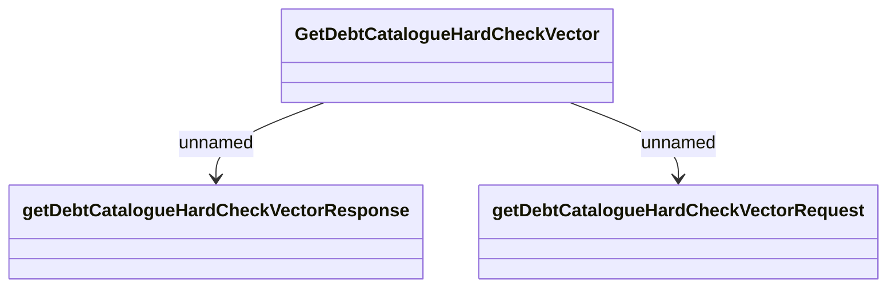

# GetDectCatalogueHardCheckVector_v2

```mermaid
classDiagram
    class GetDebtCatalogueHardCheckVector["GetDebtCatalogueHardCheckVector"]
    class getDebtCatalogueHardCheckVectorRequest["getDebtCatalogueHardCheckVectorRequest"]
    class getDebtCatalogueHardCheckVectorResponse["getDebtCatalogueHardCheckVectorResponse"]
    GetDebtCatalogueHardCheckVector --> getDebtCatalogueHardCheckVectorResponse : unnamed
    GetDebtCatalogueHardCheckVector --> getDebtCatalogueHardCheckVectorRequest : unnamed
```
