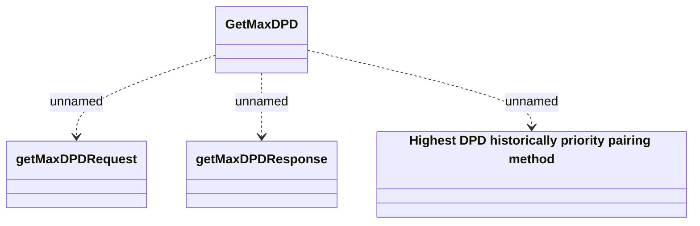

# GetMaxDPD

- **Diagram Type**: Logical
- **Package**: HomerSelect/BSL/Modules/Debt catalogue/Interface Provided/REST/GetMaxDPD
- **Diagram ID**: 155607
- **Elements**: 4
- **Connectors**: 3

```mermaid
classDiagram
    class Highest_DPD_historically_priority_pairing_method["Highest DPD historically priority pairing method"]
    class getMaxDPDResponse["getMaxDPDResponse"]
    class getMaxDPDRequest["getMaxDPDRequest"]
    class GetMaxDPD["GetMaxDPD"]
    GetMaxDPD ..> getMaxDPDRequest : unnamed
    GetMaxDPD ..> getMaxDPDResponse : unnamed
    GetMaxDPD ..> Highest_DPD_historically_priority_pairing_method : unnamed
```
