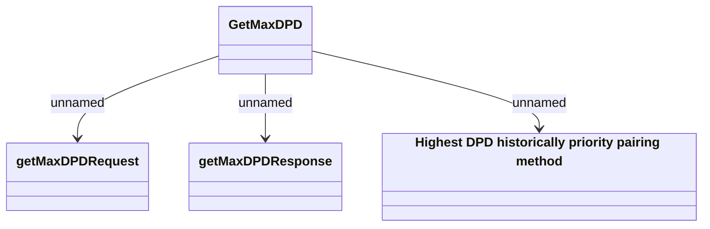

# GetMaxDPD

```mermaid
classDiagram
    class Highest_DPD_historically_priority_pairing_method["Highest DPD historically priority pairing method"]
    class getMaxDPDResponse["getMaxDPDResponse"]
    class getMaxDPDRequest["getMaxDPDRequest"]
    class GetMaxDPD["GetMaxDPD"]
    GetMaxDPD --> getMaxDPDRequest : unnamed
    GetMaxDPD --> getMaxDPDResponse : unnamed
    GetMaxDPD --> Highest_DPD_historically_priority_pairing_method : unnamed
```
