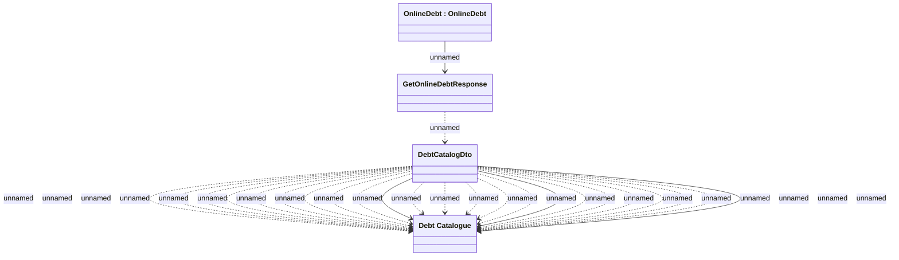

# GetOnlineDebtResponse - Mapping to DebtCatalog

- **Diagram Type**: Logical
- **Package**: HomerSelect/BSL/Modules/Debt catalogue/Interface Provided/REST/OnlineDebt
- **Diagram ID**: 155682
- **Elements**: 4
- **Connectors**: 25

