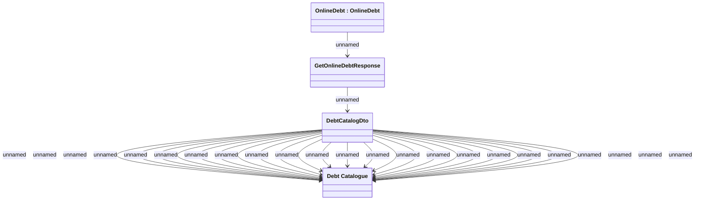

# GetOnlineDebtResponse - Mapping to DebtCatalog

```mermaid
classDiagram
    class OnlineDebt_OnlineDebt["OnlineDebt : OnlineDebt"]
    class GetOnlineDebtResponse["GetOnlineDebtResponse"]
    class Debt_Catalogue["Debt Catalogue"]
    class DebtCatalogDto["DebtCatalogDto"]
    DebtCatalogDto --> Debt_Catalogue : unnamed
    DebtCatalogDto --> Debt_Catalogue : unnamed
    DebtCatalogDto --> Debt_Catalogue : unnamed
    DebtCatalogDto --> Debt_Catalogue : unnamed
    DebtCatalogDto --> Debt_Catalogue : unnamed
    DebtCatalogDto --> Debt_Catalogue : unnamed
    DebtCatalogDto --> Debt_Catalogue : unnamed
    DebtCatalogDto --> Debt_Catalogue : unnamed
    DebtCatalogDto --> Debt_Catalogue : unnamed
    DebtCatalogDto --> Debt_Catalogue : unnamed
    DebtCatalogDto --> Debt_Catalogue : unnamed
    OnlineDebt_OnlineDebt --> GetOnlineDebtResponse : unnamed
    DebtCatalogDto --> Debt_Catalogue : unnamed
    GetOnlineDebtResponse --> DebtCatalogDto : unnamed
    DebtCatalogDto --> Debt_Catalogue : unnamed
    DebtCatalogDto --> Debt_Catalogue : unnamed
    DebtCatalogDto --> Debt_Catalogue : unnamed
    DebtCatalogDto --> Debt_Catalogue : unnamed
    DebtCatalogDto --> Debt_Catalogue : unnamed
    DebtCatalogDto --> Debt_Catalogue : unnamed
    DebtCatalogDto --> Debt_Catalogue : unnamed
    DebtCatalogDto --> Debt_Catalogue : unnamed
    DebtCatalogDto --> Debt_Catalogue : unnamed
    DebtCatalogDto --> Debt_Catalogue : unnamed
    DebtCatalogDto --> Debt_Catalogue : unnamed
```
