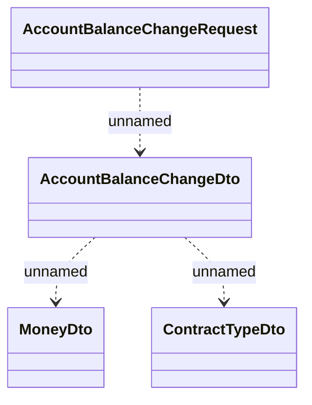

# Account Balance Change v4

- **Diagram Type**: Logical
- **Package**: HomerSelect/BSL/Modules/Debt catalogue/Interface Provided/RabbitMQ/Account Balance Change/v4
- **Diagram ID**: 161262
- **Elements**: 4
- **Connectors**: 3

