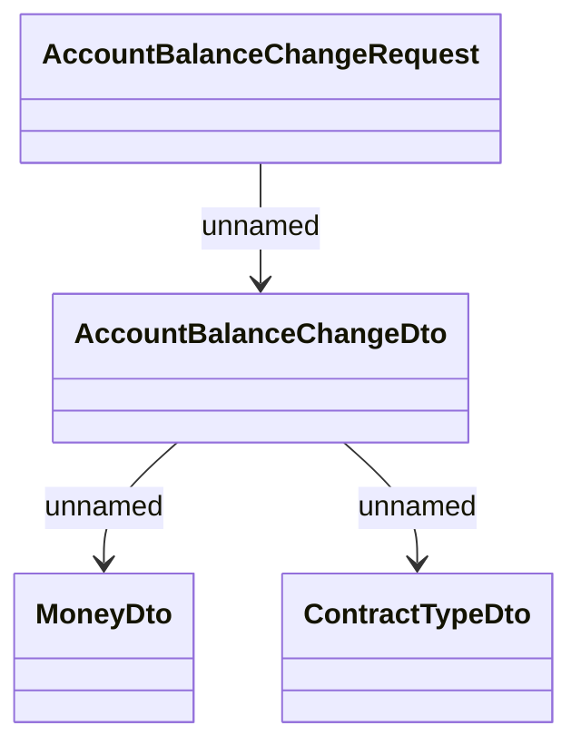

# Account Balance Change v4

```mermaid
classDiagram
    class ContractTypeDto["ContractTypeDto"]
    class MoneyDto["MoneyDto"]
    class AccountBalanceChangeDto["AccountBalanceChangeDto"]
    class AccountBalanceChangeRequest["AccountBalanceChangeRequest"]
    AccountBalanceChangeDto --> MoneyDto : unnamed
    AccountBalanceChangeDto --> ContractTypeDto : unnamed
    AccountBalanceChangeRequest --> AccountBalanceChangeDto : unnamed
```
