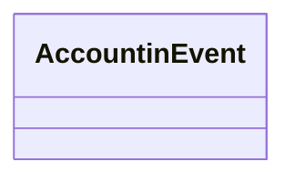

# AccountingEvent

- **Diagram Type**: Logical
- **Package**: HomerSelect/BSL/Modules/Debt catalogue/Interface Provided/RabbitMQ/Accounting Events/v1.0/AccountingEvent
- **Diagram ID**: 149512
- **Elements**: 1
- **Connectors**: 0

