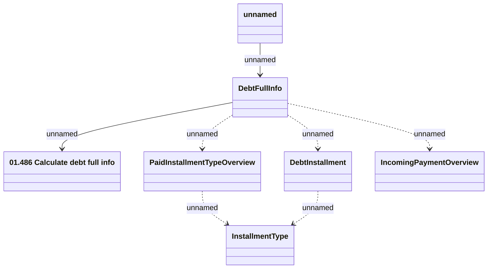

# DebtFullInfo

- **Diagram Type**: Logical
- **Package**: HomerSelect/BSL/Modules/Debt catalogue/Interface Provided/RabbitMQ/DebtFullInfo/v1.0/DebtFullInfoMessage
- **Diagram ID**: 155405
- **Elements**: 7
- **Connectors**: 7

