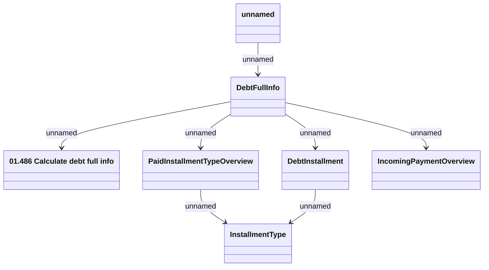

# DebtFullInfo

```mermaid
classDiagram
    class n_01_486_Calculate_debt_full_info["01.486 Calculate debt full info"]
    class InstallmentType["InstallmentType"]
    class PaidInstallmentTypeOverview["PaidInstallmentTypeOverview"]
    class DebtInstallment["DebtInstallment"]
    class IncomingPaymentOverview["IncomingPaymentOverview"]
    class DebtFullInfo["DebtFullInfo"]
    unnamed --> DebtFullInfo : unnamed
    DebtFullInfo --> IncomingPaymentOverview : unnamed
    DebtFullInfo --> DebtInstallment : unnamed
    DebtFullInfo --> PaidInstallmentTypeOverview : unnamed
    PaidInstallmentTypeOverview --> InstallmentType : unnamed
    DebtInstallment --> InstallmentType : unnamed
    DebtFullInfo --> n_01_486_Calculate_debt_full_info : unnamed
```
