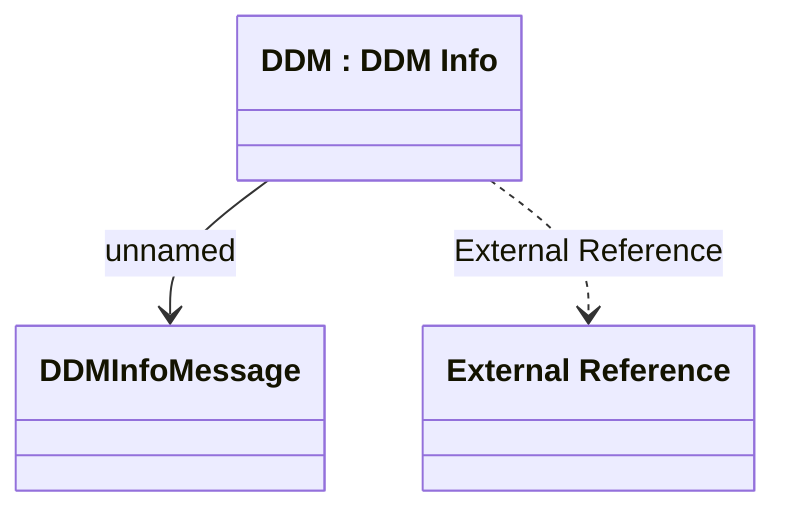

# DDM Info

- **Diagram Type**: Logical
- **Package**: HomerSelect/BSL/Modules/Direct debit (DD)/Consumed RMQ/DDM Info
- **Diagram ID**: 163220
- **Elements**: 3
- **Connectors**: 2

```mermaid
classDiagram
    class DDMInfoMessage["DDMInfoMessage"]
    class External_Reference["External Reference"]
    class DDM_DDM_Info["DDM : DDM Info"]
    DDM_DDM_Info --> DDMInfoMessage : unnamed
    DDM_DDM_Info ..> External_Reference : External Reference
```
