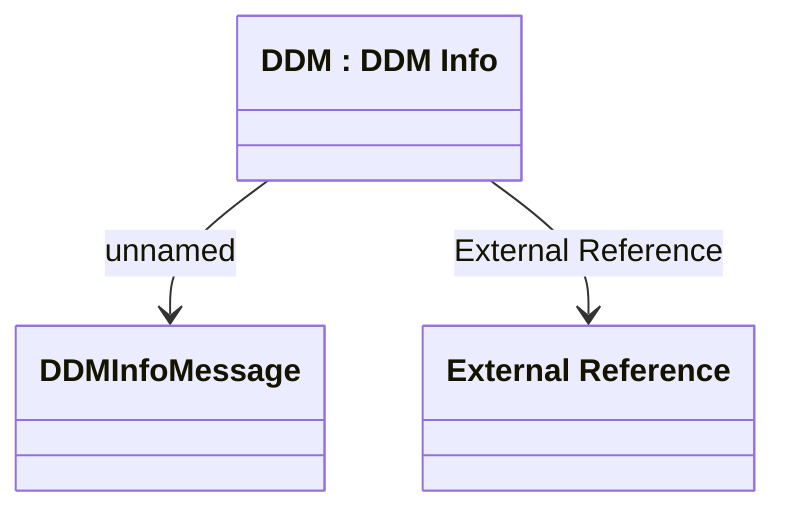

# DDM Info

```mermaid
classDiagram
    class DDMInfoMessage["DDMInfoMessage"]
    class DDM_DDM_Info["DDM : DDM Info"]
    class External_Reference["External Reference"]
    DDM_DDM_Info --> DDMInfoMessage : unnamed
    DDM_DDM_Info --> External_Reference : External Reference
```
