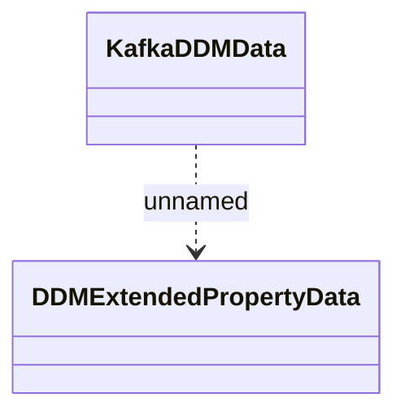

# Kafka Messages

- **Diagram Type**: Logical
- **Package**: HomerSelect/BSL/Modules/Direct debit (DD)/Kafka Messages/dd.direct-debit-mandate-data.v2
- **Diagram ID**: 162576
- **Elements**: 2
- **Connectors**: 1

