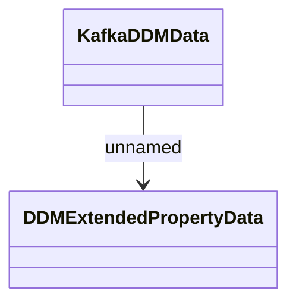

# Kafka Messages

```mermaid
classDiagram
    class DDMExtendedPropertyData["DDMExtendedPropertyData"]
    class KafkaDDMData["KafkaDDMData"]
    KafkaDDMData --> DDMExtendedPropertyData : unnamed
```
