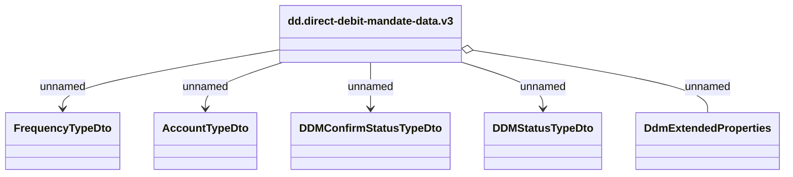

# dd.direct-debit-mandate-data.v3

- **Diagram Type**: Logical
- **Package**: HomerSelect/BSL/Modules/Direct debit (DD)/Kafka Messages/dd.direct-debit-mandate-data.v3
- **Diagram ID**: 162577
- **Elements**: 6
- **Connectors**: 5

