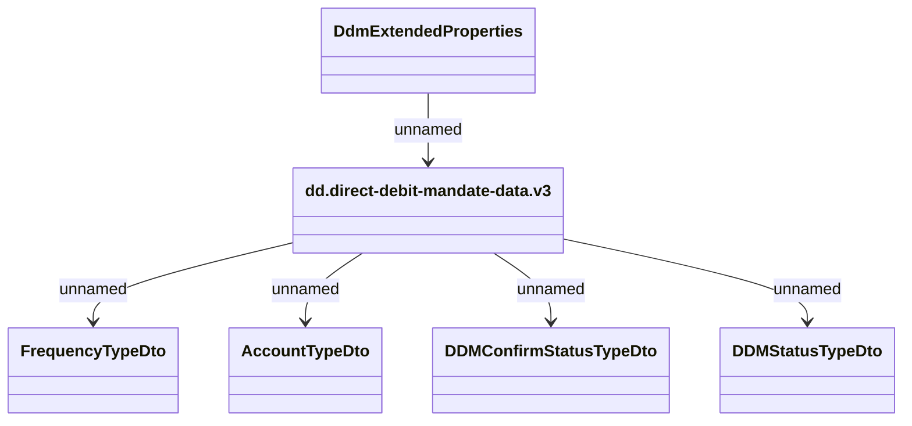

# dd.direct-debit-mandate-data.v3

```mermaid
classDiagram
    class FrequencyTypeDto["FrequencyTypeDto"]
    class DDMStatusTypeDto["DDMStatusTypeDto"]
    class DDMConfirmStatusTypeDto["DDMConfirmStatusTypeDto"]
    class AccountTypeDto["AccountTypeDto"]
    class DdmExtendedProperties["DdmExtendedProperties"]
    class dd_direct_debit_mandate_data_v3["dd.direct-debit-mandate-data.v3"]
    dd_direct_debit_mandate_data_v3 --> FrequencyTypeDto : unnamed
    dd_direct_debit_mandate_data_v3 --> AccountTypeDto : unnamed
    dd_direct_debit_mandate_data_v3 --> DDMConfirmStatusTypeDto : unnamed
    dd_direct_debit_mandate_data_v3 --> DDMStatusTypeDto : unnamed
    DdmExtendedProperties --> dd_direct_debit_mandate_data_v3 : unnamed
```
