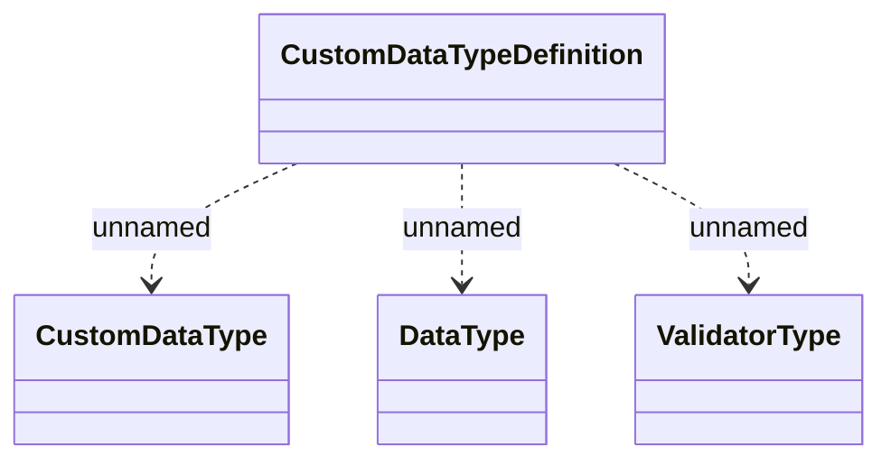

# Custom Data Type - Logical Data Model

- **Diagram Type**: Logical
- **Package**: HomerSelect/BSL/Modules/Document management (DMS)/Custom data types definition and validator library/Logical Data Model
- **Diagram ID**: 141607
- **Elements**: 5
- **Connectors**: 3

