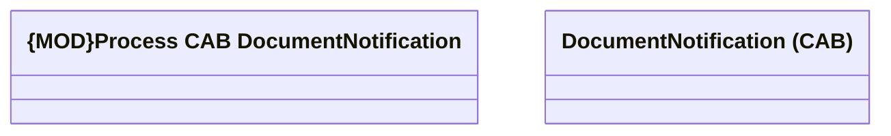

# DocumentNotification

- **Diagram Type**: Logical
- **Package**: HomerSelect/BSL/Modules/Document management (DMS)/Interface Consumed/RabbitMQ/Cabinet/DocumentNotification (CAB)
- **Diagram ID**: 164705
- **Elements**: 3
- **Connectors**: 0

