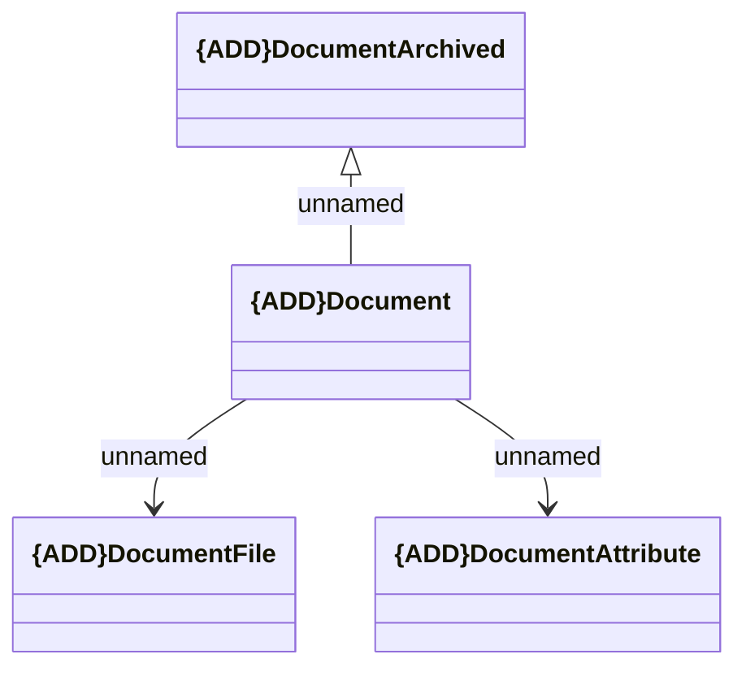

# Document Instance notifications

- **Diagram Type**: Logical
- **Package**: HomerSelect/BSL/Modules/Document management (DMS)/Interface Provided/Generated Messages/Document Instance notifications
- **Diagram ID**: 164332
- **Elements**: 5
- **Connectors**: 3

