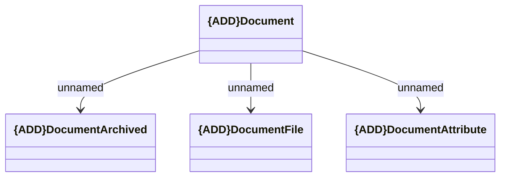

# Document Instance notifications

```mermaid
classDiagram
    class ADD_DocumentAttribute["{ADD}DocumentAttribute"]
    class ADD_DocumentFile["{ADD}DocumentFile"]
    class ADD_DocumentArchived["{ADD}DocumentArchived"]
    class ADD_Document["{ADD}Document"]
    ADD_Document --> ADD_DocumentArchived : unnamed
    ADD_Document --> ADD_DocumentFile : unnamed
    ADD_Document --> ADD_DocumentAttribute : unnamed
```
