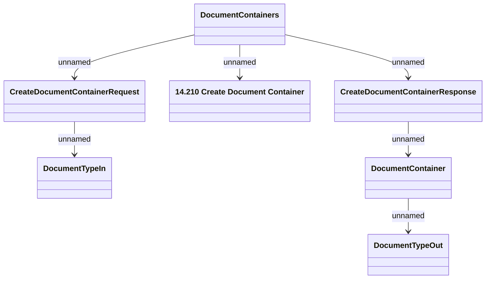

# CreateDocumentContainer

```mermaid
classDiagram
    class DocumentTypeIn["DocumentTypeIn"]
    class CreateDocumentContainerRequest["CreateDocumentContainerRequest"]
    class n_14_210_Create_Document_Container["14.210 Create Document Container"]
    class CreateDocumentContainerResponse["CreateDocumentContainerResponse"]
    class DocumentTypeOut["DocumentTypeOut"]
    class DocumentContainer["DocumentContainer"]
    class DocumentContainers["DocumentContainers"]
    CreateDocumentContainerRequest --> DocumentTypeIn : unnamed
    DocumentContainers --> CreateDocumentContainerRequest : unnamed
    DocumentContainers --> n_14_210_Create_Document_Container : unnamed
    DocumentContainers --> CreateDocumentContainerResponse : unnamed
    DocumentContainer --> DocumentTypeOut : unnamed
    CreateDocumentContainerResponse --> DocumentContainer : unnamed
```
