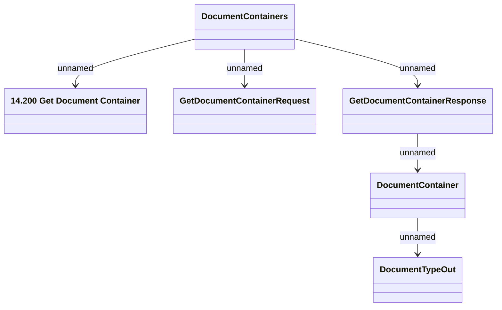

# GetDocumentContainer

```mermaid
classDiagram
    class DocumentTypeOut["DocumentTypeOut"]
    class n_14_200_Get_Document_Container["14.200 Get Document Container"]
    class DocumentContainer["DocumentContainer"]
    class GetDocumentContainerRequest["GetDocumentContainerRequest"]
    class GetDocumentContainerResponse["GetDocumentContainerResponse"]
    class DocumentContainers["DocumentContainers"]
    DocumentContainer --> DocumentTypeOut : unnamed
    DocumentContainers --> n_14_200_Get_Document_Container : unnamed
    GetDocumentContainerResponse --> DocumentContainer : unnamed
    DocumentContainers --> GetDocumentContainerRequest : unnamed
    DocumentContainers --> GetDocumentContainerResponse : unnamed
```
