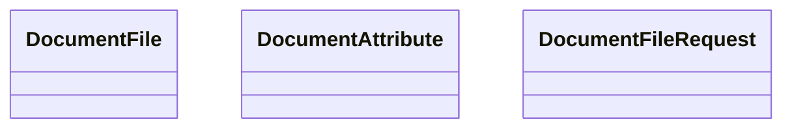

# COMMON for Interface Model

- **Diagram Type**: Logical
- **Package**: HomerSelect/BSL/Modules/Document management (DMS)/Interface Provided/Web Service/Document Instance Services/COMMON for Interface Model_v2
- **Diagram ID**: 148514
- **Elements**: 3
- **Connectors**: 0

