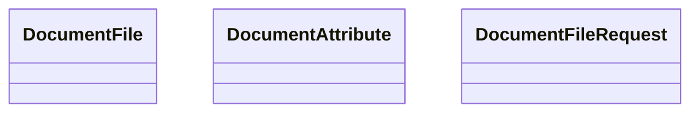

# COMMON for Interface Model

```mermaid
classDiagram
    class DocumentFile["DocumentFile"]
    class DocumentAttribute["DocumentAttribute"]
    class DocumentFileRequest["DocumentFileRequest"]
```
