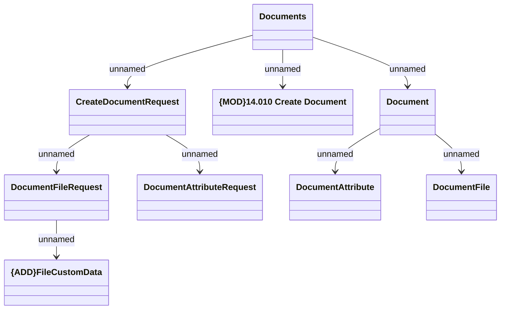

# CreateDocument

```mermaid
classDiagram
    class DocumentAttributeRequest["DocumentAttributeRequest"]
    class ADD_FileCustomData["{ADD}FileCustomData"]
    class Document["Document"]
    class DocumentFile["DocumentFile"]
    class DocumentAttribute["DocumentAttribute"]
    class MOD_14_010_Create_Document["{MOD}14.010 Create Document"]
    class DocumentFileRequest["DocumentFileRequest"]
    class Documents["Documents"]
    class CreateDocumentRequest["CreateDocumentRequest"]
    CreateDocumentRequest --> DocumentFileRequest : unnamed
    CreateDocumentRequest --> DocumentAttributeRequest : unnamed
    Documents --> CreateDocumentRequest : unnamed
    Documents --> MOD_14_010_Create_Document : unnamed
    Documents --> Document : unnamed
    DocumentFileRequest --> ADD_FileCustomData : unnamed
    Document --> DocumentAttribute : unnamed
    Document --> DocumentFile : unnamed
```
