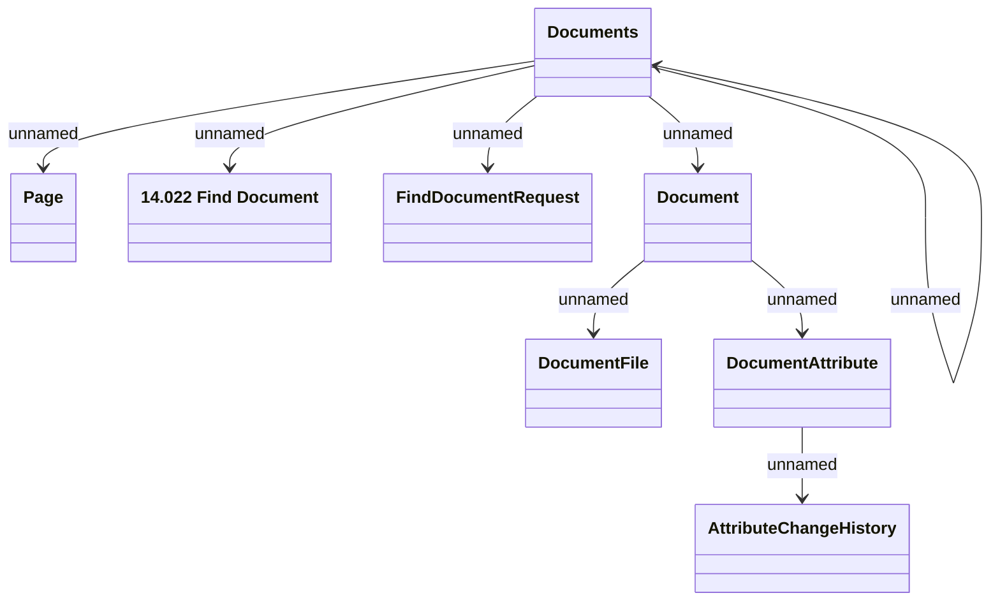

# FindDocument

```mermaid
classDiagram
    class AttributeChangeHistory["AttributeChangeHistory"]
    class Page["Page"]
    class DocumentFile["DocumentFile"]
    class DocumentAttribute["DocumentAttribute"]
    class n_14_022_Find_Document["14.022 Find Document"]
    class Documents["Documents"]
    class FindDocumentRequest["FindDocumentRequest"]
    class Document["Document"]
    class Documents["Documents"]
    Documents --> n_14_022_Find_Document : unnamed
    Documents --> FindDocumentRequest : unnamed
    Documents --> Documents : unnamed
    Document --> DocumentAttribute : unnamed
    Document --> DocumentFile : unnamed
    Documents --> Document : unnamed
    Documents --> Page : unnamed
    DocumentAttribute --> AttributeChangeHistory : unnamed
```
