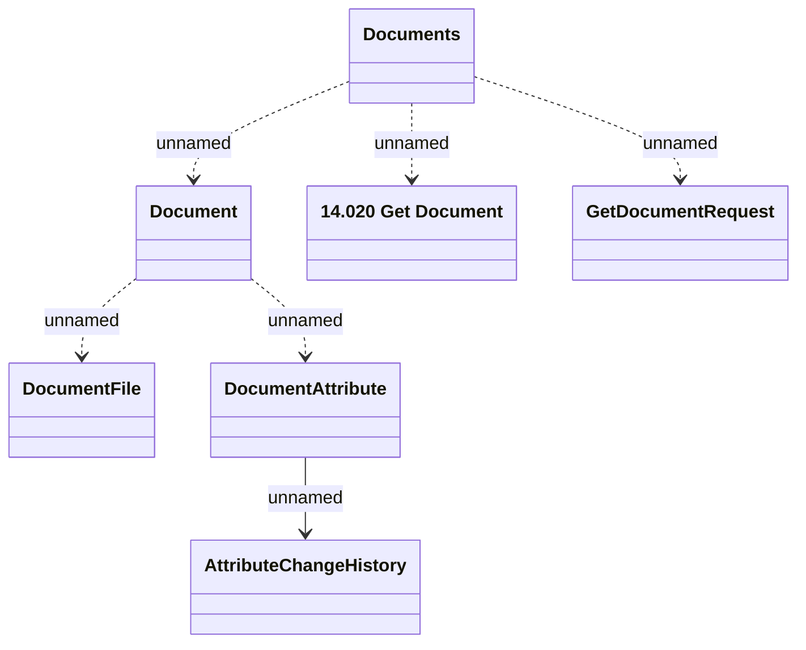

# GetDocument

- **Diagram Type**: Logical
- **Package**: HomerSelect/BSL/Modules/Document management (DMS)/Interface Provided/Web Service/Document Instance Services/Documents_v2
- **Diagram ID**: 164536
- **Elements**: 7
- **Connectors**: 6

