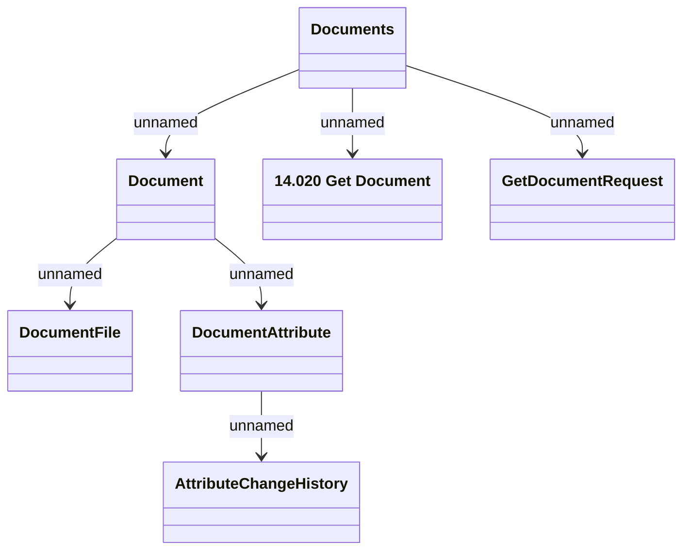

# GetDocument

```mermaid
classDiagram
    class AttributeChangeHistory["AttributeChangeHistory"]
    class Document["Document"]
    class DocumentFile["DocumentFile"]
    class DocumentAttribute["DocumentAttribute"]
    class n_14_020_Get_Document["14.020 Get Document"]
    class GetDocumentRequest["GetDocumentRequest"]
    class Documents["Documents"]
    Documents --> GetDocumentRequest : unnamed
    Documents --> Document : unnamed
    Documents --> n_14_020_Get_Document : unnamed
    DocumentAttribute --> AttributeChangeHistory : unnamed
    Document --> DocumentAttribute : unnamed
    Document --> DocumentFile : unnamed
```
