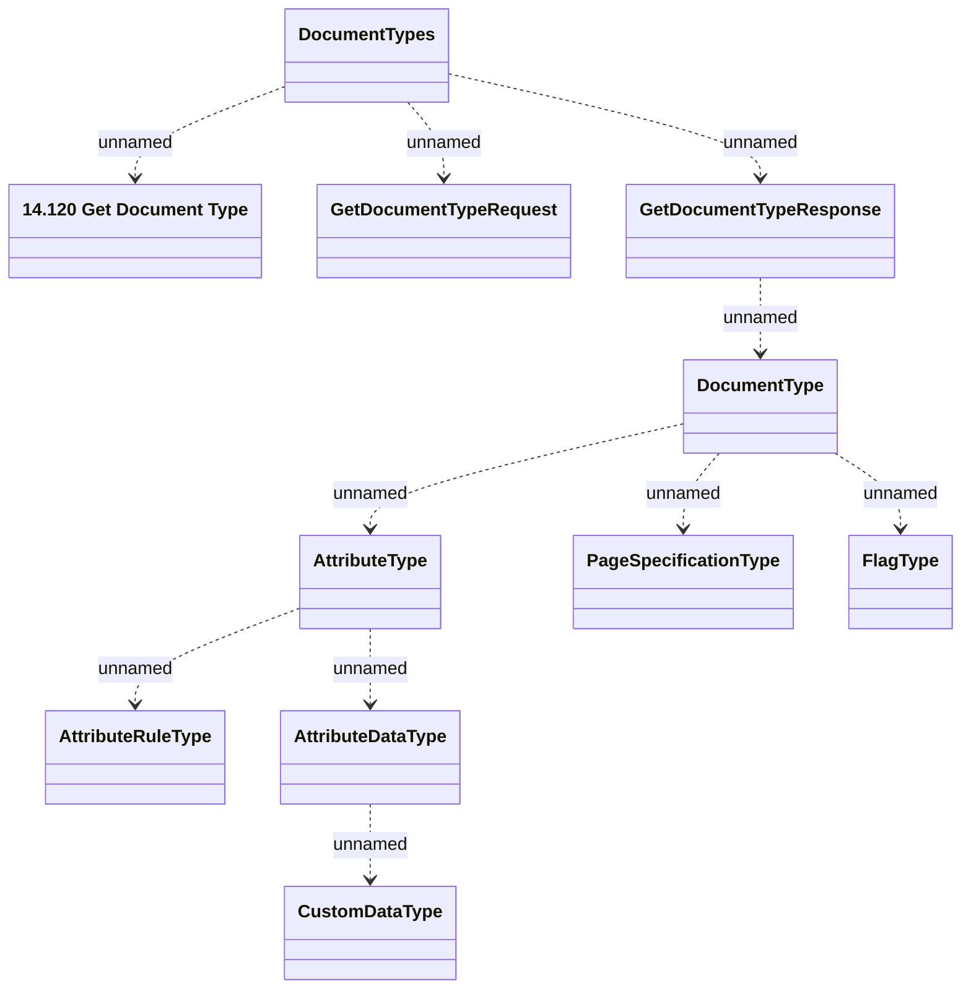

# Document Type Services - Interface Model

- **Diagram Type**: Logical
- **Package**: HomerSelect/BSL/Modules/Document management (DMS)/Interface Provided/Web Service/Document Type Services
- **Diagram ID**: 164331
- **Elements**: 11
- **Connectors**: 10

