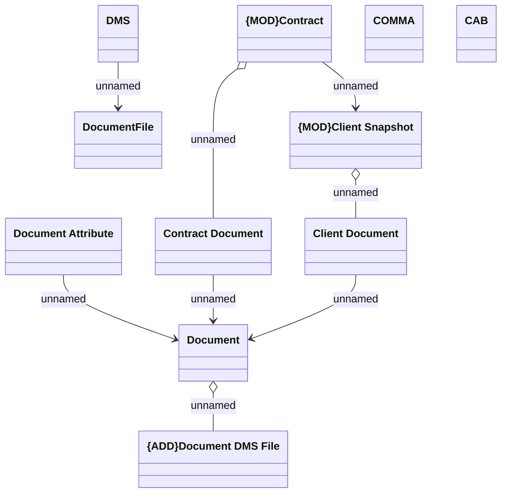

# Logical Data Model

- **Diagram Type**: Logical
- **Package**: HomerSelect/BSL/Modules/Document management (DMS)/Requirement Model/CBL-16225 (CSI-1363) Replacement ContractDocumentWS methods/Logical Data Model
- **Diagram ID**: 143305
- **Elements**: 11
- **Connectors**: 8

