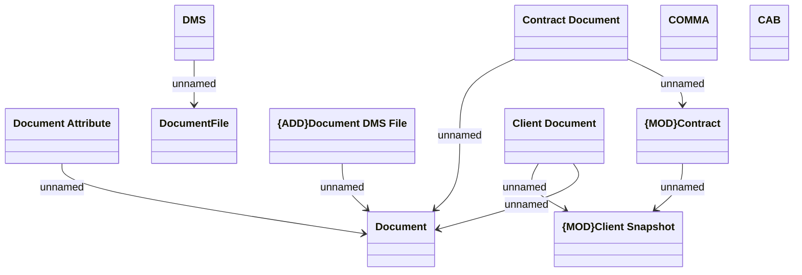

# Logical Data Model

```mermaid
classDiagram
    class Document_Attribute["Document Attribute"]
    class DocumentFile["DocumentFile"]
    class ADD_Document_DMS_File["{ADD}Document DMS File"]
    class MOD_Contract["{MOD}Contract"]
    class MOD_Client_Snapshot["{MOD}Client Snapshot"]
    class Contract_Document["Contract Document"]
    class Client_Document["Client Document"]
    class Document["Document"]
    class DMS["DMS"]
    class COMMA["COMMA"]
    class CAB["CAB"]
    DMS --> DocumentFile : unnamed
    Document_Attribute --> Document : unnamed
    Contract_Document --> Document : unnamed
    Contract_Document --> MOD_Contract : unnamed
    MOD_Contract --> MOD_Client_Snapshot : unnamed
    Client_Document --> MOD_Client_Snapshot : unnamed
    Client_Document --> Document : unnamed
    ADD_Document_DMS_File --> Document : unnamed
```
