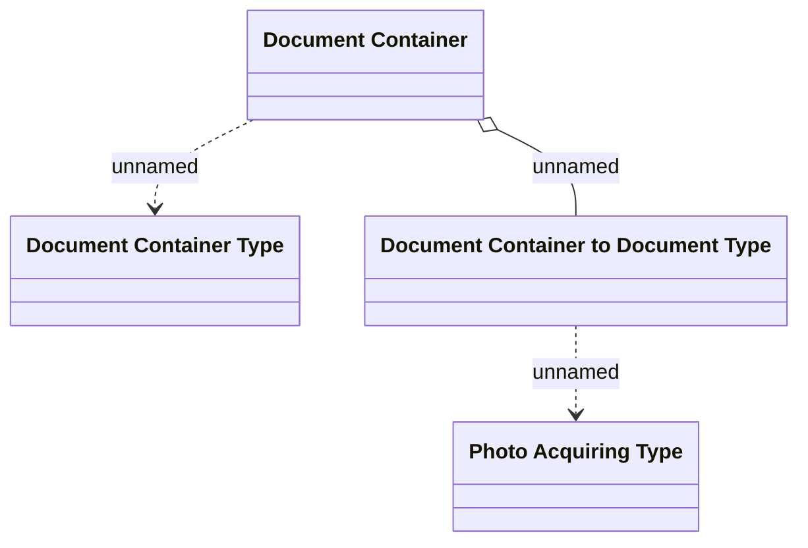

# Document Container

- **Diagram Type**: Logical
- **Package**: HomerSelect/BSL/Modules/Document management (DMS_NG)/Analytical Model/Document Container/Logical Data Model
- **Diagram ID**: 162118
- **Elements**: 4
- **Connectors**: 3

