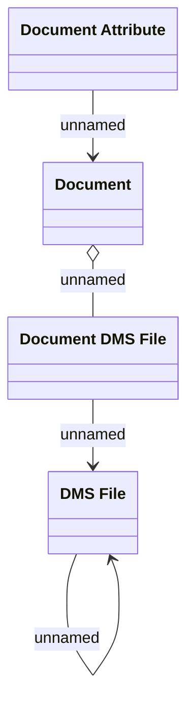

# Document Instace - Logical Data Model

- **Diagram Type**: Logical
- **Package**: HomerSelect/BSL/Modules/Document management (DMS_NG)/Analytical Model/Document Instances/Logical Data Model
- **Diagram ID**: 162121
- **Elements**: 4
- **Connectors**: 4

